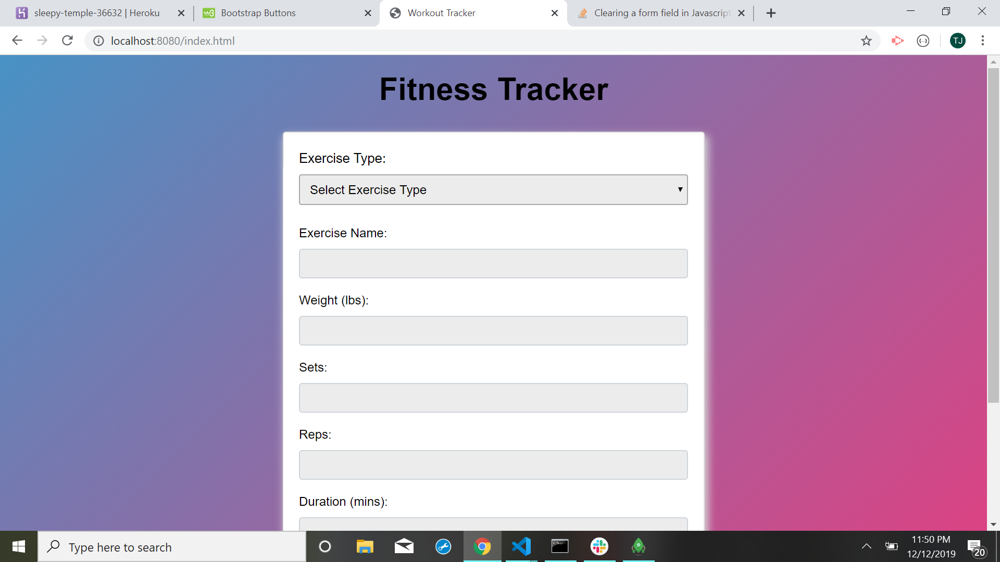
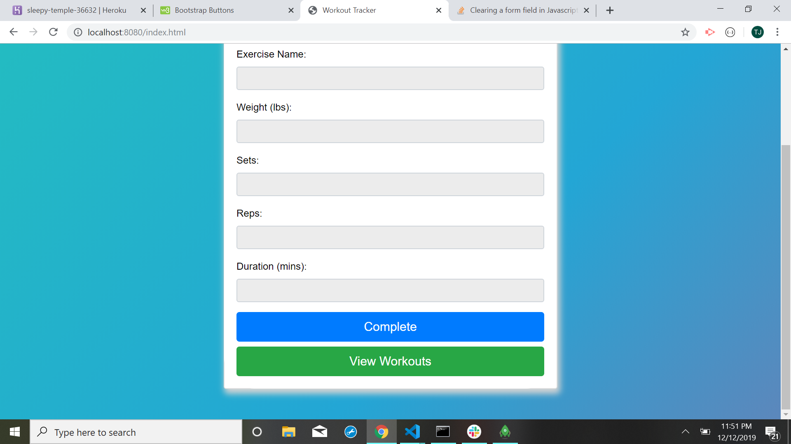
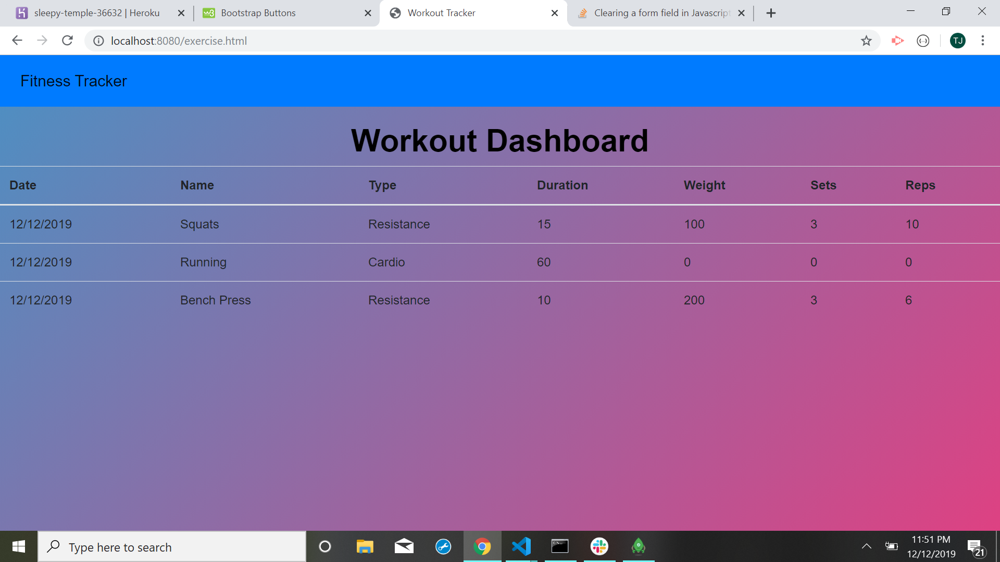

# Workout Tracker

### Description
Consumers will reach their fitness goals faster when they can easily follow their workout progress. I created a Workout Tracker where users are able to view, create and track their daily workouts.

### Technologies-Libraries
Mongoose - Node - Express - JavaScript - [JQuery](https://code.jquery.com/jquery-3.3.1.slim.min.js) - [Bootstrap](https://getbootstrap.com/) - CSS - HTML

### Screenshots

### Link
Check it out!
https://github.com/Tjcheetham/workoutTracker/.
